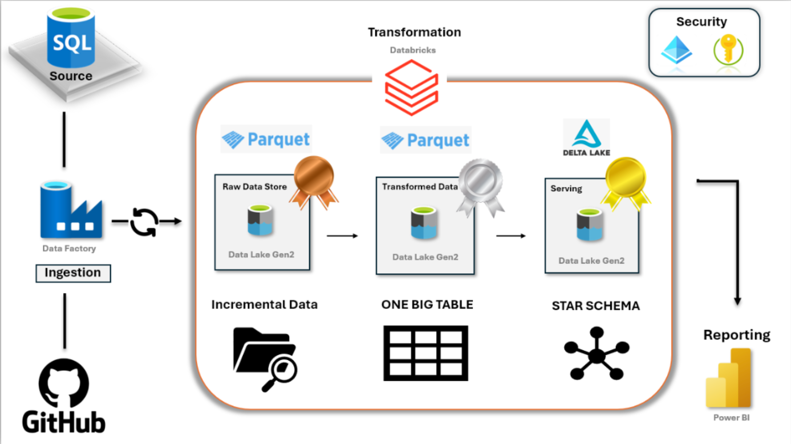
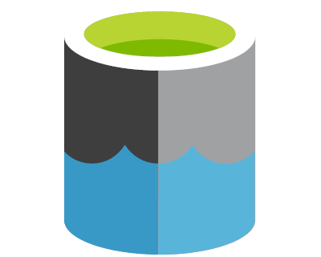

# Car-Sales-Analysis-DE-Project

This production-ready project is designed to analyze car sales data through an end-to-end ETL pipeline. It seamlessly integrates data ingestion from GitHub, links it to Azure SQL Database for storage, and employs Azure services for transformation. Using Azure Data Factory, Azure Data Lake Gen2, Databricks, and Unity Catalog for secure access (via access tokens), the pipeline is architected on the medallion framework. It delivers a consolidated table for data scientists and a star schema for data analysts, enabling robust analytics and impactful visualizations.

---

## Key Components of the Pipeline

1. **SQL Source**

    - The data is ingested from GitHub and stored in an Azure SQL Database.

    - This serves as the source for ingestion into the pipeline.

2. **Ingestion (Azure Data Factory)**

    - Azure Data Factory orchestrates the ingestion of data from the SQL source into the pipeline.

    - The ingested data is stored in Data Lake Gen2 in its raw form.

3. **Raw Data Store**

    - The raw data is stored in Azure Data Lake Gen2.

    - Data is saved in Parquet format for optimized storage and querying.

4. **Transformation (Databricks)**

    - Data transformation is performed using Azure Databricks.

    - Databricks processes the raw data to generate transformed and cleaned datasets.

5. **Transformed Data**

    - The transformed data is stored back in Azure Data Lake Gen2.

    - The output data is also saved in Parquet format.

6. **Serving (Delta Lake)**

    - The processed and transformed data is prepared for serving.

    - It is stored in Delta Lake on Azure Data Lake Gen2, which supports advanced data capabilities such as versioning and ACID transactions.

7. **Incremental Data**

    - The pipeline supports incremental data processing to handle updates and new data efficiently.

8. **Data Modeling**

    - The data is modeled into two formats for downstream consumption:

    - One Big Table: Consolidates all relevant data.

    - Star Schema: A structured model for analytics and reporting.

9. **Security**

    - Azure Key Vault and Azure Active Directory (AAD) ensure secure access and authentication for the pipeline components.

---

## Pipeline Flow

1. **Source to Ingestion**: Data flows from GitHub to Azure SQL Database and then into Azure Data Factory for ingestion.

2. **Raw Storage**: The raw data is stored in Data Lake Gen2 as Parquet files.

3. **Transformation**: Azure Databricks processes the data and outputs transformed datasets.

4. **Serving Layer**: The transformed data is stored in Delta Lake for serving to consumers.

5. **Data Models**: Incremental data updates are consolidated into a single table or structured as a star schema for analytics.

---

## Tools and Technologies Used

1. : Initial data source, API Connections.

2. : Centralized storage for raw data.

3. : Orchestration and ingestion.

4. : Storage for raw, transformed, and served data.

5. : Data transformation and processing.

6. : Enhanced data storage and serving.

7. : Optimized file format for data storage.

8. : Transform data with PySpark.

9. : Governance with Unity Catalog
---

## Use Cases

1. Data ingestion from GitHub repositories to Azure SQL Database.

2. Transformation and cleaning of large datasets.

3. Secure and efficient storage of raw and processed data.

4. Serving data for analytics and reporting with structured models.

---
